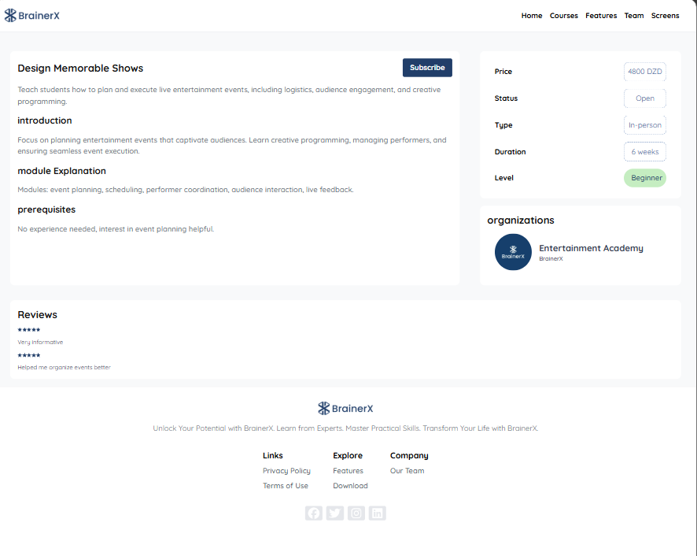
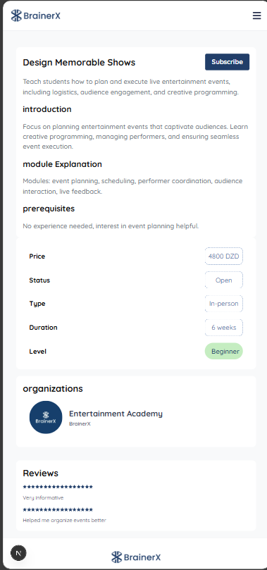
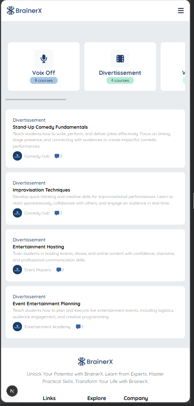
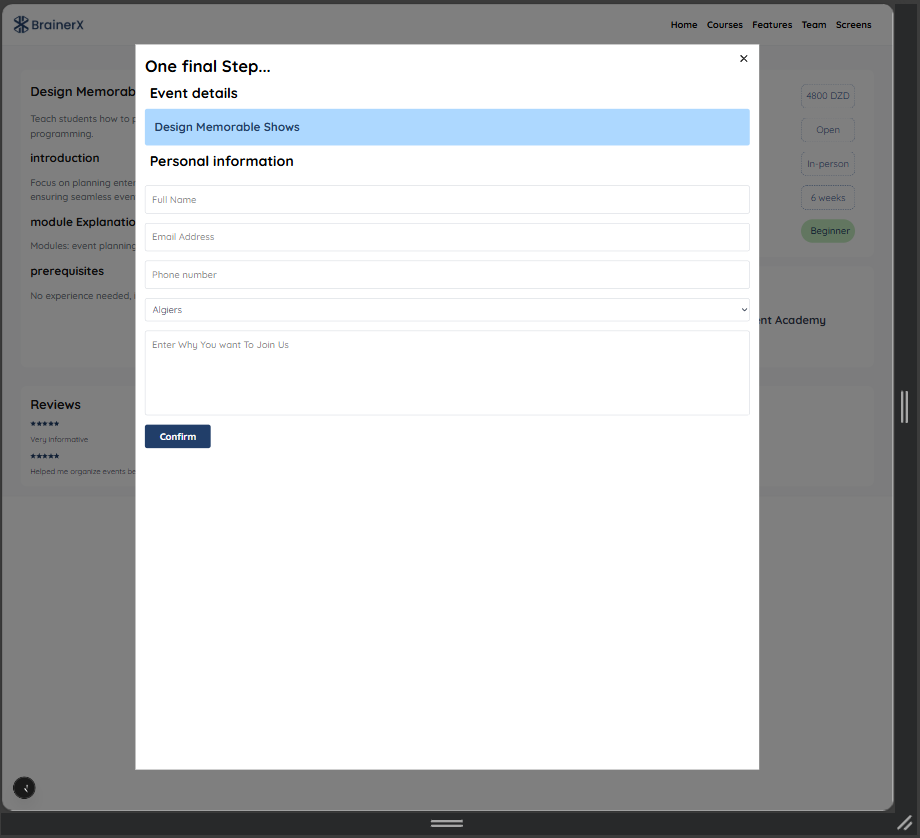
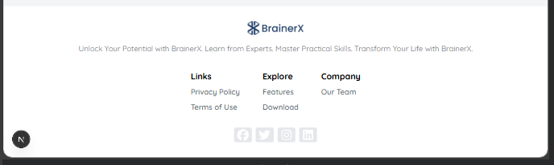
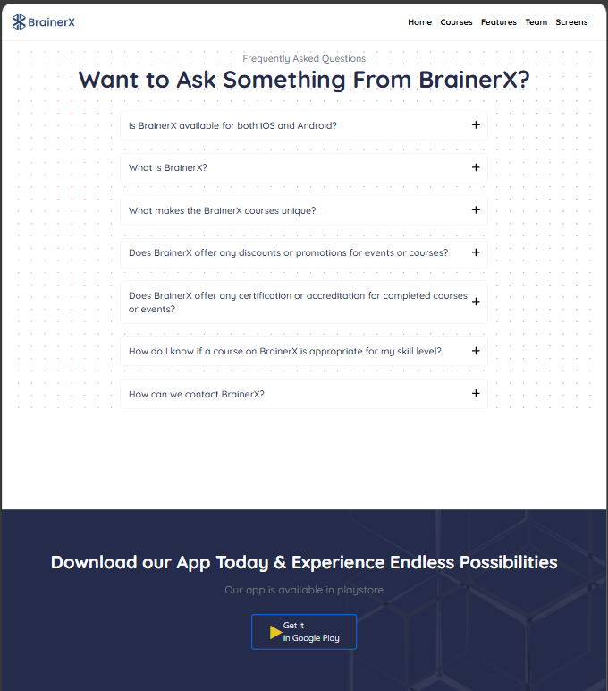
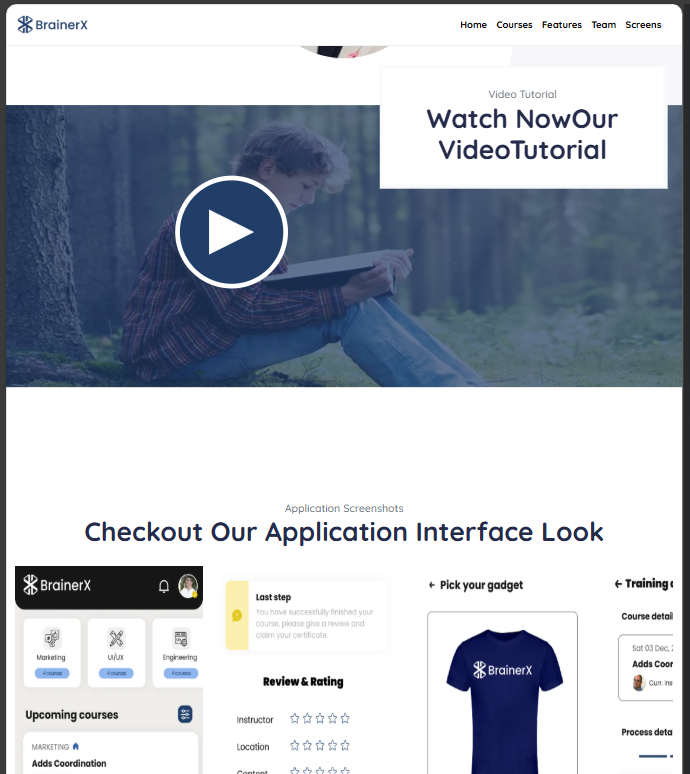
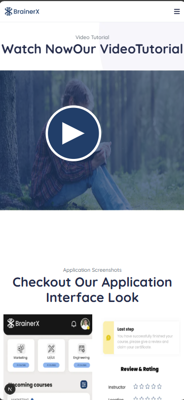
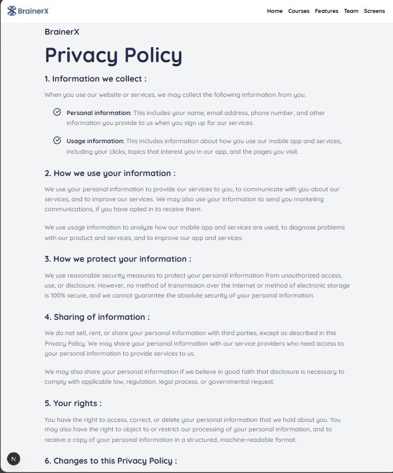

# BrainX 🎓  
the link for the deployed version of this website  : https://brainer-x-remake-git-main-rajaas-projects-04901519.vercel.app/

BrainX is a frontend web application built as a **enhancement of the official website of brainerX**.  
The platform presents educational courses, allows users to explore course details, and subscribe through a dynamic form-based workflow.

This project focuses on **modern frontend development practices**, UI structuring, and client-side routing.

---

## ✨ Features

- 🏠 **Landing Page**
  - Overview of the platform
  - Feature list
  - Team section
  - Tutorial explaining how to use the platform and create courses
  - screenshot of the mobile application 
  - Frequently asked questions (FAQ)

- 📚 **Courses Section**
  - View all available courses
  - Navigate to individual course pages
  - Detailed information for each course
  - Subscription flow for selected courses

- 📝 **Course Subscription**
  - Dynamic form handling
  - User input validation
  - Subscription confirmation logic

- 🔀 **Dynamic Routing**
  - Navigate from courses list → individual course pages
  - Clean and structured URL paths

- 📄 **Legal Pages**
  - Privacy Policy
  - Terms of Use

---

## 🛠️ Technologies Used

- **React**
- **NEXT.js**
- **CSS Modules**
- **Tailwind CSS**
- **Framer Motion** (animations & transitions)

---

## 🎯 Project Goals

- Practice building a **real-world frontend application**
- Improve understanding of:
  - Component-based architecture
  - Dynamic routing
  - Form handling and validation
  - UI/UX enhancement using animations
- Recreate and enhance an existing website with better structure and modern tools

---

## 🖼️ Screenshots

Screenshots of the application are provided to showcase:
- Landing page
- Courses list
- Course details page
- Subscription form
- Legal pages














## 🚀 Getting Started

1. Clone the repository:
   ```bash
   git clone https://github.com/your-username/brainx.git


